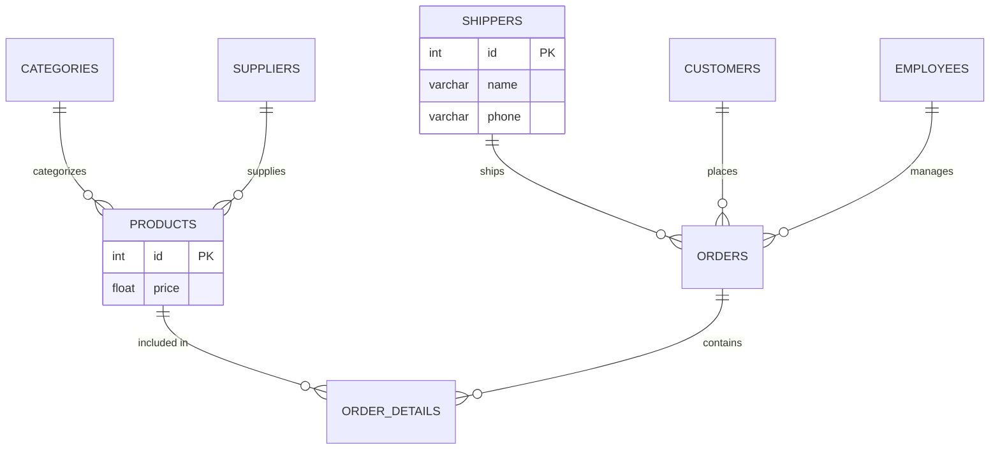
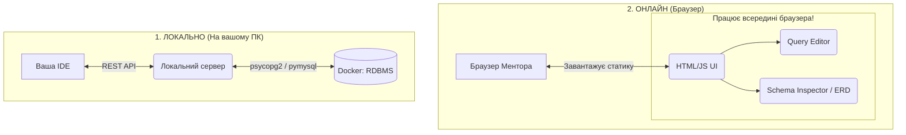
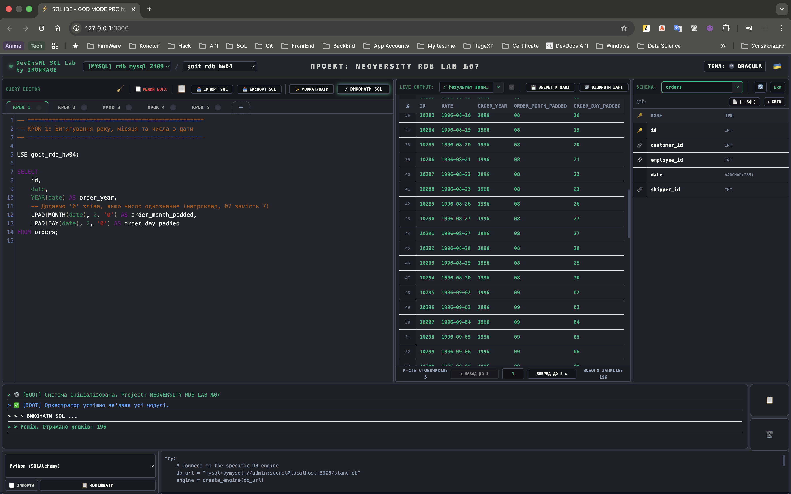
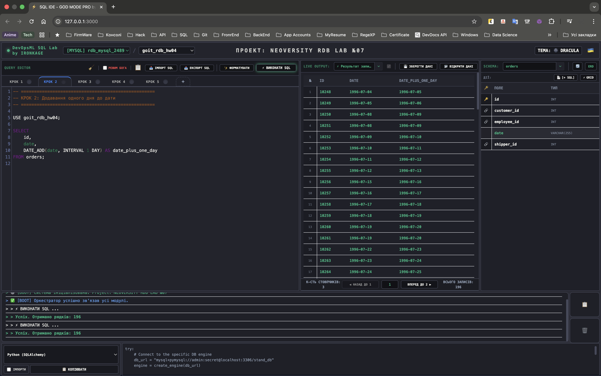
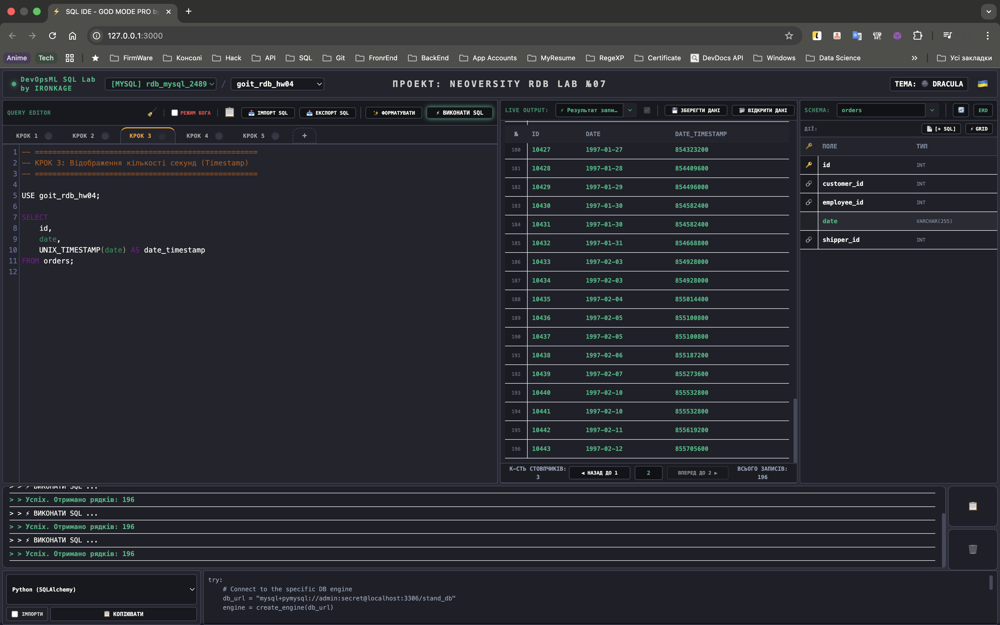
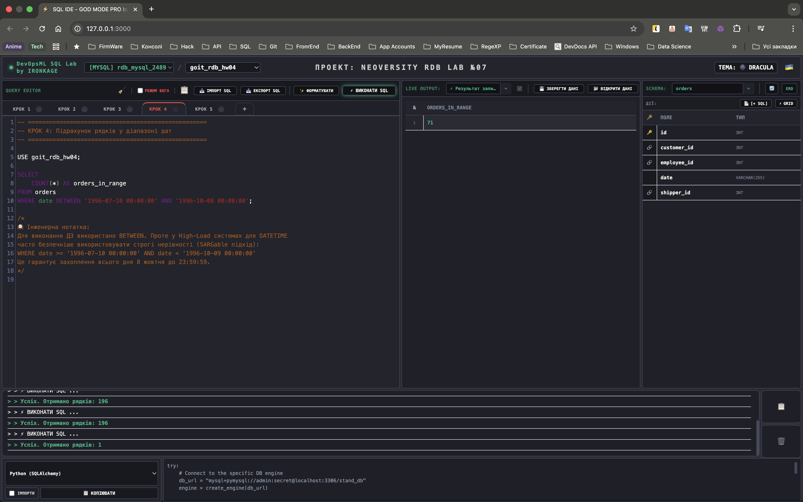
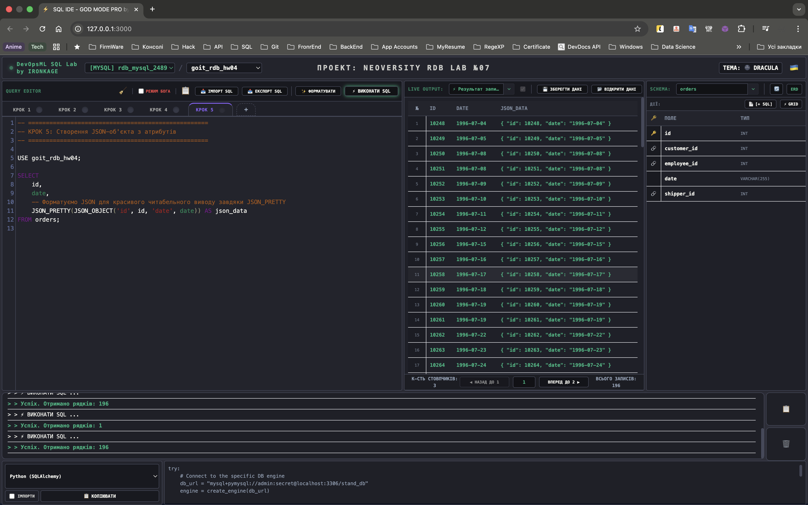
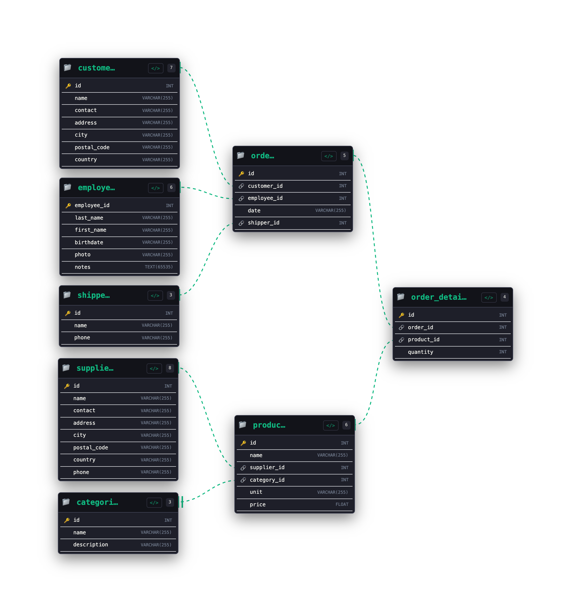
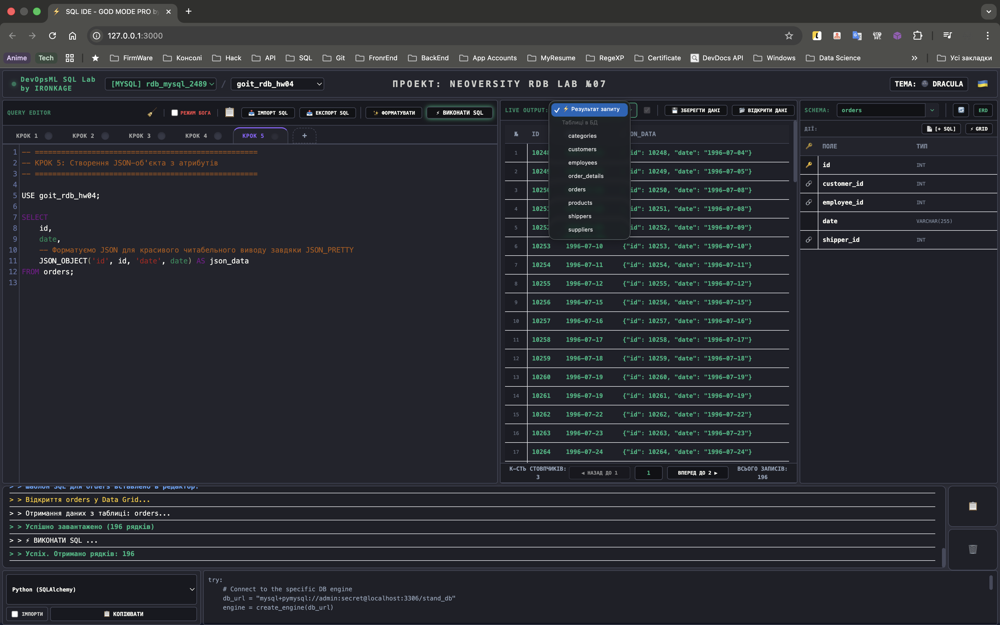

# goit-rdb-hw-07


***Технiчний опис завдань***

## **Тема 7: Додаткові вбудовані SQL функції. Робота з часом**

### Вам потрібно буде:

Ви вже володієте необхідними знаннями, щоб працювати з часовою інформацією та JSON-атрибутами в `SQL`. Наразі спробуємо перейти до практичного застосування вивченого інструментарію.

### Це завдання допоможе вам:

Мета цього завдання — попрактикуватись **використовувати основні функції для операцій із часом в SQ**L та трохи **працювати з JSON-атрибутами**.

Ці навички необхідні для розв’язання реальних завдань у сфері аналітики, розробки програмного забезпечення та обробки великих обсягів даних.

### Підготовка та завантаження домашнього завдання:

1. Створіть публічний репозиторій `goit-rdb-hw-07`
2. Виконайте завдання та відправте у свій репозиторій скриншоти запитів і результатів, а також текст SQL-коду в текстовому файлі
3. Завантажте скриншоти і текстовий файл на свій комп’ютер та прикріпіть їх в LMS архівом. Назва архіву повинна бути у форматі `ДЗ7_ПІБ`
4. Прикріпіть посилання на репозиторій `goit-rdb-hw-07` та відправте на перевірку

> 💡 Будь ласка, пронумеровуйте скріншоти, щоб менторам було зрозуміло, до якого етапу ДЗ відноситься кожний з них. Наприклад, якщо файл відноситься до пункту 3, то назва файла має починатися так: `p3_`.

### Опис домашнього завдання:

1. Напишіть SQL-запит, який для таблиці `orders` з атрибута `date` витягує *рік*, *місяць* і *число*
    - Виведіть на екран їх у три окремі атрибути поряд з атрибутом `id` та оригінальним атрибутом `date` (всього вийде 5 атрибутів)
2. Напишіть SQL-запит, який для таблиці `orders` до атрибута `date` додає *один день*
    - На екран виведіть атрибут `id`, оригінальний атрибут `date` та результат додавання
3. Напишіть SQL-запит, який для таблиці `orders` для атрибута `date` відображає *кількість секунд* з початку відліку (показує його значення **timestamp**)
    - Для цього потрібно знайти та застосувати необхідну функцію
    - На екран виведіть атрибут `id`, оригінальний атрибут `date` та результат роботи функції
4. Напишіть SQL-запит, який рахує, скільки таблиця `orders` містить рядків з атрибутом `date` у межах між `1996-07-10 00:00:00` та `1996-10-08 00:00:00`
5. Напишіть SQL-запит, який для таблиці `orders` виводить на екран атрибут `id`, атрибут `date` та *JSON-об’єкт* `{"id": <атрибут id рядка>, "date": <атрибут date рядка>}`
    - Для створення *JSON-об’єкта* використайте функцію

### Критерії прийняття:

> **Критерії прийняття домашнього завдання є обов’язковою умовою оцінювання домашнього завдання ментором. Якщо якийсь з критеріїв не виконано, ДЗ відправляється ментором на доопрацювання без оцінювання.**
> Якщо вам “тільки уточнити”😉 або ви “застопорилися” на якомусь з етапів виконання — звертайтеся до ментора у Slack :)

1. Прикріплені посилання на репозиторій `goit-rdb-hw-07` та безпосередньо самі файли репозиторію архівом
2. Написано всі 5 запитів відповідно до заданих умов виконання. `SQL-запити` виконуються й повертають необхідні дані

---

## 🛡️ DevOpsML SQL Lab - Завдання 07 (goit-rdb-hw-07)

### 1. Як все запустити

Завдяки вбудованому оркестратору (`Makefile`), запуск і налаштування інфраструктури повністю автоматизовані.

#### 🚀 Швидкий запуск (В одну команду)

1. Клонуйте репозиторій.
2. Переконайтесь, що у вас встановлені **Docker** та **Make**.
3. Створіть файл `.env` з паролями (дивіться `.env.example`).
4. Виконайте команду:

   ```bash
   make start
   ```

- 🐳 Перевірить і самостійно запустить Docker (якщо він був вимкнений).
- 🧱 Підніме Backend-інфраструктуру (API ядро та Adminer).
- 📦 Ініціалізує ізольоване віртуальне середовище `.venv`.
- 🌐 Запустить Frontend-сервер.
- 🖥️ **Самостійно відкриє браузер** із готовою SQL IDE за адресою `http://127.0.0.1:3000`.

### 📦 Standalone-версія

Для збірки проекту в єдиний HTML-файл (включаючи JS, CSS та вшитий SQL-код):

```bash
make build
```

#### 🛠️ Додаткові команди (Управління ядром)

Ваш термінал тепер — це пульт управління всіма базами даних. Ось основні команди:

- `make help` — показати інтерактивне меню з усіма доступними командами.
- `make db-manage` — відкрити CLI-менеджер фабрики баз даних (дозволяє на льоту створювати/видаляти контейнери з PostgreSQL, MySQL, MSSQL чи Oracle).
- `make db-adminer` — автоматично відкрити резервну панель **Adminer** у браузері (`http://127.0.0.1:8080`).
- `make down` — безпечно зупинити всі контейнери Backend-у.
- `make clean` — **Hard Reset**: жорстко видаляє всі згенеровані бази даних, контейнери, мережу та `.venv`, повертаючи проект до абсолютно чистого стану.

---

### 2. Структура проекту, ER-діаграма та Flowchart

#### Структура проекту - Логічний (Business-Logic First)

```text
goit-rdb-hw-07/                 # 🌌 Універсальний простір стенду
│
├── backend/                    # 🐍 Backend Service (Python / FastAPI)
│   ├── main.py                 # REST API та SQL Execution Engine
│   ├── db_manager.py           # 🗄️ CLI-менеджер інфраструктури (Docker, Dump/Restore)
│   ├── Dockerfile              # 🫍 Конфігурація мікросервісу
│   └── requirements.txt        # 🧬 Залежності бекенду
│
├── frontend/                   # 🌐 Frontend App (Vanilla JS / Event-Driven)
│   ├── css/                    # 🎨 Tailwind конфіги та UI теми (Dracula/Alucard)
│   ├── dicts/                  # 🧠 Словники IntelliSense для різних СУБД
│   │   ├── mssql.json          # Словник для MS SQL Server
│   │   ├── mysql.json          # Словник для MySQL
│   │   ├── oracle.json         # Словник для Oracle DB
│   │   └── postgres.json       # Словник для PostgreSQL
│   ├── js/                     # ⚙️ Бізнес-логіка та Архітектура
│   │   ├── core.js             # 🚀 Точка входу (Entry Point) — ініціалізація та запуск системи
│   │   ├── config.js           # 🔧 Статична конфігурація (API_URL, PROJECT_NAME)
│   │   └── components/         # 🧩 Ізольовані UI-модулі
│   │       ├── editor/            # 📦 Підсистема Редактора (Ізольований домен)
│   │       │   ├── TabManager.js     # 🗂️ Логіка "Картотеки" (JSON State, кольори, створення/закриття табів)
│   │       │   └── ToolbarActions.js # 🛠️ Логіка панелі інструментів (Execute, Format, Import/Export)
│   │       ├── 1_WorkspaceHeader.js  # 🎛️ Панель управління, підключення та теми
│   │       ├── 2_QueryEditor.js      # 🎩 Фасад Редактора (Layout, ініціалізація CodeMirror та зв'язка модулів з папки editor/)
│   │       ├── 3_DataGrid.js         # 📊 Рендеринг таблиць та ETL-імпорт CSV
│   │       ├── 4_SchemaInspector.js  # 🕸️ Генерація ER-діаграм (Mermaid.js) та навігація по схемі
│   │       ├── 5_ConsoleLogger.js    # 💻 Вбудований термінал логів та помилок
│   │       ├── 6_SnippetEngine.js    # ✂️ Управління шаблонами коду та автозаповненням
│   │       └── 7_UIController.js     # 🚌 Event Bus (Шина подій) та Головний Оркестратор (Mediator)
│   ├── locales/                # 🌍 Мовні пакети (uk.js, en.js)
│   ├── sql/                    # 📜 SQL-скрипти (DDL/DML/DQL)
│   │   └── Step_*.sql          # 🏆 Ізольовані кроки SQL-запитів для поточного ДЗ
│   └── index.html              # Головний Entry Point
│
├── data/                       # 📊 Набір даних (ETL Sources)
│   └── *.csv                   # Сирі дані для імпорту в таблиці
│
├── img/                        # 🖼️ Медіа-ассети для оформлення ReadMe.md
│   └── *.png                   # Скриншоти результатів для здачі ДЗ в LMS
│
├── .venv/                      # 📦 Ізольоване середовище Python (Автогенерація)
├── databases.json              # 🗄️ Реєстр активних БД-контейнерів
├── docker-compose.yml          # 🐳 Мережева інфраструктура
├── Makefile                    # 🪄 Головний Оркестратор (make start, make db-add)
├── builder.py                  # 🛠️ CI/CD Бандлер (Збірка HTML версії)
├── hw_submission.html          # 📦 Фінальний артефакт (Генерується 'make build')
├── sql_query_***.sql           # 💾 Експортовані нашою IDE SQL-скрипти для MySQL
├── backup_mysql_2489_***.sql   # 📦 Повний SQL-дамп MySQL
├── .editorconfig               # ⚙️ Правила форматування коду для IDE
├── .gitignore                  # 🙈 Файли, які ігнорує Git
└── README.md                   # 📖 Технічна документація проекту
```

#### ER-Діаграма Датасету (Mermaid)



#### Архітектура виконання



---

### 3. Висновки з усіма світлинами

У ході виконання **Завдання 7** було відпрацьовано використання вбудованих SQL-функцій для роботи з часовими даними (Date/Time Functions) та генерації JSON-об'єктів на стороні СУБД.

#### 📝 Інженерний висновок: Оптимізація обробки даних

> **1. Екстракція та маніпуляція часом:**
> У Кроках 1 та 2 було продемонстровано використання нативних функцій `YEAR()`, `MONTH()`, `DAY()` та `DATE_ADD()`. Делегування парсингу та математики дат на рівень ядра MySQL є Best Practice, оскільки це мінімізує ризики помилок із часовими поясами (Timezone issues) при передачі сирих даних на бекенд-сервіси. Також застосовано функцію `LPAD` для форматування місяців та днів у строгий двозначний формат (Zero-Padding), що є стандартом для фінансових звітів.
>
> **2. Уніфікація через UNIX Timestamp:**
> У Кроці 3 застосовано функцію `UNIX_TIMESTAMP()`. Перетворення формату `DATETIME` у кількість секунд з епохи UNIX (1 січня 1970) є стандартом де-факто для передачі часових міток через `REST API`. Це дозволяє будь-якому клієнту (незалежно від мови програмування чи локального часу) коректно обробити та відрендерити час.
> *⚠️ Інженерне застереження (Проблема 2038 року - Y2K38):* При архітектурному плануванні варто пам'ятати, що класичний 32-бітний UNIX-час переповниться 19 січня 2038 року. Тому для довгострокових проектів та High-Load систем важливо переконатися, що на рівні БД для зберігання міток використовуються 64-бітні цілі числа (`BIGINT`). Це відкладе проблему переповнення до **292 мільярдів років** (у секундах) або до **292 мільйонів років** (у мілісекундах). Наша система гарантовано переживе Сонячну систему!
>
> **3. Фільтрація та Агрегація JSON:**
> У Кроці 4 успішно відпрацьовано оператор `BETWEEN` для безпечної фільтрації діапазонів дат (додатково залишено архітектурну нотатку щодо SARGable оптимізації для High-Load систем).
> У Кроці 5 реалізовано генерацію JSON-об'єкта безпосередньо в SQL. Завдяки комбінації `JSON_PRETTY(JSON_OBJECT())` ми отримали не просто валідний, а й одразу відформатований (Human-Readable) JSON.
> *Перевага підходу:* Використання нативних функцій БД знімає зайве навантаження з бекенду (Backend Offloading). Значно ефективніше генерувати структурований JSON на рівні оптимізованого рушія C++ у MySQL, ніж передавати масиви сирих даних через мережу для серіалізації в Python.

#### 🖼️ Світлини виконання та висновки

**Крок 1: Екстракція частин дати** *(Використання `YEAR`, `MONTH`, `DAY` та `LPAD` для парсингу)*


**Крок 2: Математика дат** *(Додавання інтервалу за допомогою `DATE_ADD`)*


**Крок 3: Перетворення у Timestamp** *(Конвертація в UNIX-формат для API-сумісності)*


**Крок 4: Фільтрація діапазонів** *(Підрахунок кількості замовлень оператором `BETWEEN`)*


**Крок 5: Генерація JSON-об'єкта** *(Створення структурованого JSON на льоту за допомогою `JSON_OBJECT` та `JSON_PRETTY`)*


#### 📊 Фінальна ER-діаграма згенерована системою

*Таблиці в базі даних goit_rdb_hw04:*


*Бази даних у СУБД MySQL (Інтерфейс моєї IDE):*


---

### 4. 🚀 Аудит екосистеми: DevOpsML SQL Lab

Наша IDE складається з 6 повністю незалежних, але глибоко інтегрованих модулів. Кожен модуль відповідає за свою зону і спілкується з іншими через глобальний Event Bus (подієву архітектуру). *Ще є багато чого, що у майбутньому покращиться...*

| Модуль | Стан | Опис реалізації |
| :--- | :--- | :--- |
| **Workspace & Core** | ✅ | Event Bus архітектура на базі Custom Events для синхронізації станів. |
| **Query Editor** | ✅ | Вкладки (Tabs) для кроків, CodeMirror 5 з AST-форматуванням та підтримкою діалектів СУБД. |
| **Data Grid & Import** | ✅ | Транзакційний батч-імпорт (5000 рядків/чанк) з Auto-Type Inference. |
| **Schema Inspector** | ✅ | Динамічна побудова DAG-сітки таблиць та Crow's Foot нотація. |
| **Console Logger** | ✅ | Потоковий висновок системних подій з підтримкою локалізації. |
| **Snippet Engine** | ✅ | Генерація Boilerplate коду для різних СУБД та мов. |
